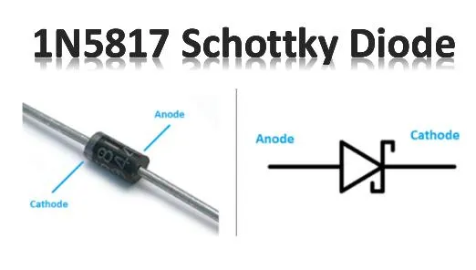
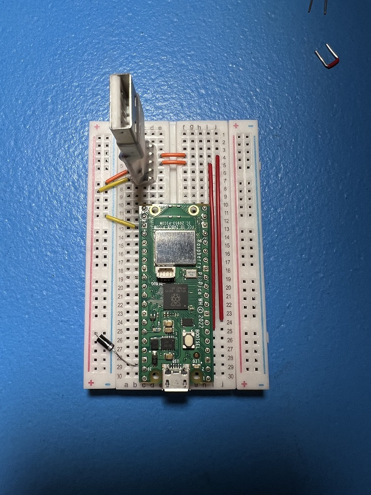
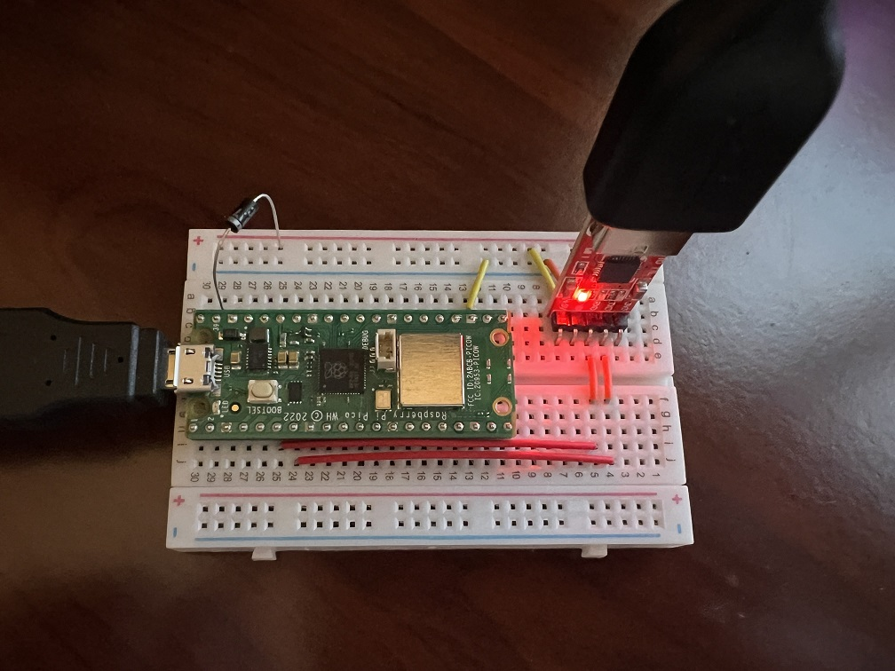
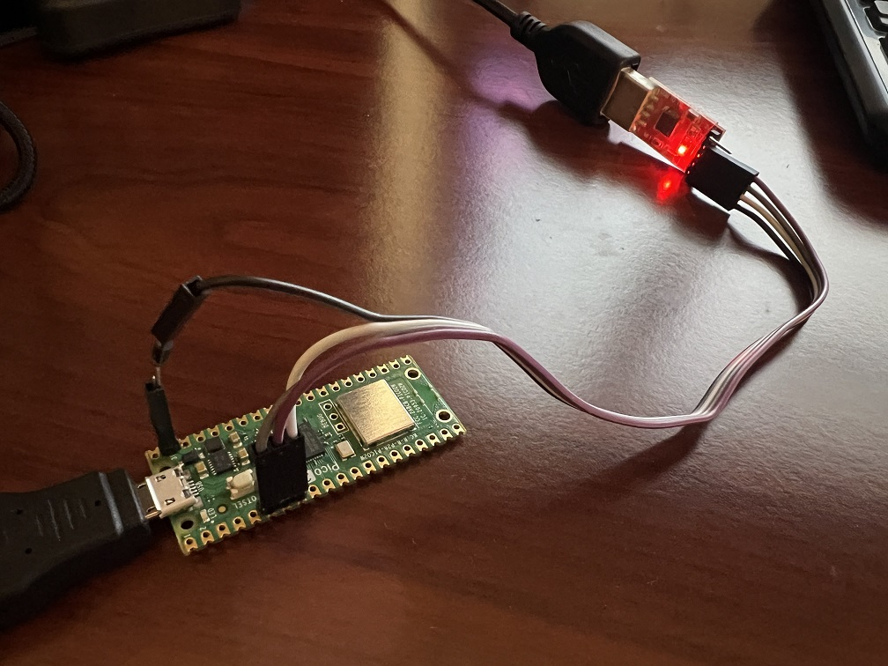
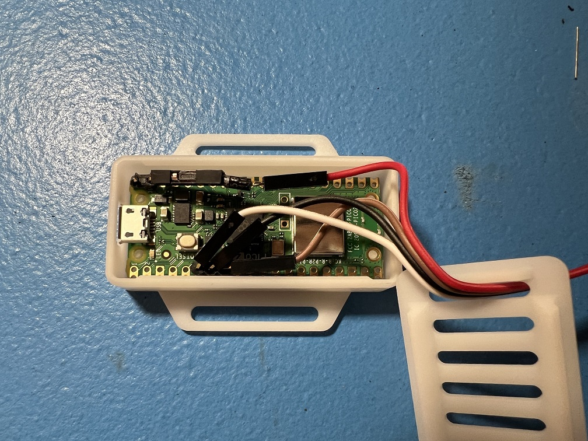
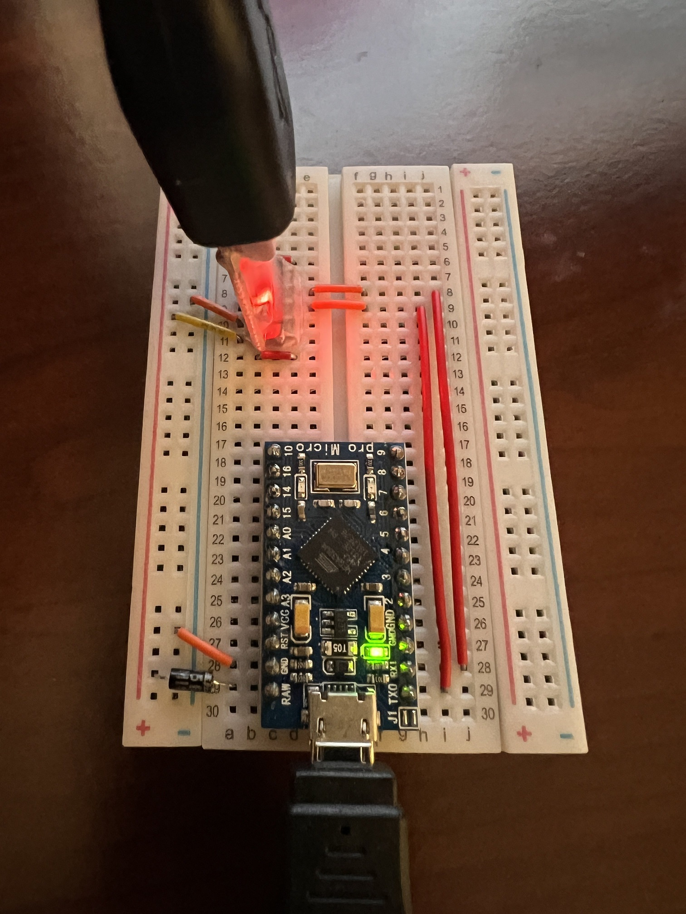
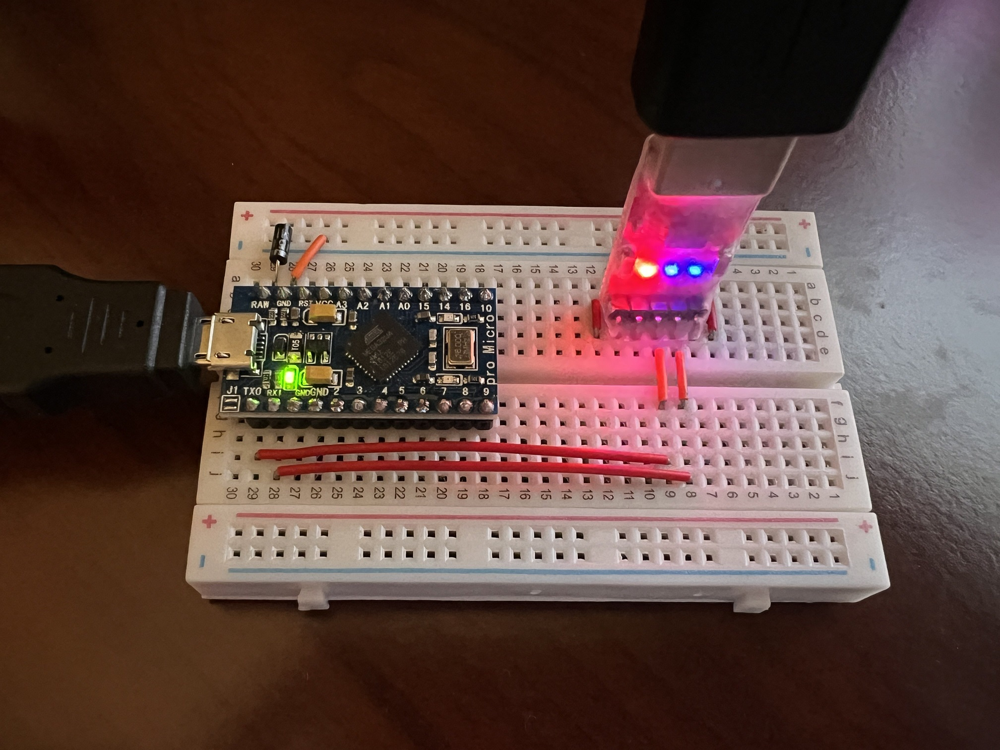

# Power Glitching

## What is Power Glitching?

Power glitching a problem that affects all controllers that rely entirely on the dock to receive power. Thus it affects:

- Pico W (UART mode)
- Arduino Uno R3
- Arduino Leonardo
- Teensy 2.0 / Teensy++ 2.0
- Pro Micro

Each time the Nintendo Switch is docked or undocked, the dock will momentarily cut the power to all its USB ports. This causes problems for boards that rely on the dock for its power.

In most cases, the microcontroller board will completely lose power and reboot properly. This is the good case and is usually not noticeable for wired controllers. For the Pico W connected wirelessly, it lose its pairing with the Switch. So you will need to re-pair.

However, in the bad case, the microcontroller board will lose enough power to "glitch", but not enough to completely shutdown. This causes the board to become unresponsive. This is really annoying because the only way to fix it is to either press the reset button on it (if it has one), or power cycle it by unplugging every single cable attach to it and plugging it back in.

On the Switch 1, the bad case almost never happens. The controller would cleanly reset unnoticed. However, on the Switch 2 and further made worse by newer firmware that has increased in complexity has made the bad (glitching) case much more common.

In fact, the ***Switch 2 docks will almost always glitch the microcontrollers***. This is why this is coming into attention now as Pokémon Legends ZA brings a lot of old-time users back to automation with their old setups on the Switch 2.

## How do I clear a power glitch?

As mentioned in the previous section, you need to reset it:

- If the board has a reset button, try pressing that.
- If that doesn't work (or there is no reset button), you need to power cycle it. That means unplugging every single cable from the board to make sure it is receiving no power at all. This includes the TX and RX lines since they contain a small amount of residual power.

Yes, this is incredibly annoying - especially now with the Switch 2 where it almost always glitches.

## How do I fix it permanently?

If you are still using the old controller setup (Uno, Leonardo, Teensy, Pro Micro), our advice is to upgrade to one of these newer setups:

- [Pico W (USB mode)](SetupGuide/Controllers/Controller-PicoW-USB.md)
- [ESP32](SetupGuide/Controllers/Controller-ESP32-WROOM.md)
- [ESP32-S3](SetupGuide/Controllers/Controller-ESP32-S3.md)

All 3 of these setups are immune to power glitching. The Pico and the ESP32 receive their power from the computer instead of the dock so they obviously don't care if the dock cuts the power. Meanwhile, the ESP32-S3 receives power from both the computer and the dock and will stay powered if either side is powering it.

Unfortunately, the Pico (UART mode) draws power from the dock and is affected. But it tends to reset more often than it glitches. Nevertheless the situation is not ideal since a reset will disconnect and unpair the wireless as well.

## I am a circuits expert. How do I fix this for real?

The solution is to wire a setup the power mechanism to be like the ESP32-S3 where the microcontroller board can be powered by either the computer or the dock.

To do this, you must connect the UART's +5V line to the board's power input line through a fast switching Schottky Diode. The connection allows the board to draw power from the computer via the UART. The purpose of the diode is to prevent backflow where power goes from the dock into the computer where it may damage one (or both) sides.

While both sides should be supplying a steady 5V, they will not be exactly the same. So power will flow from the higher side to the lower side. Most boards already have a diode that prevents backflow into its USB. So while backflow from computer -> dock is not possible, backflow from dock -> computer is possible without a diode. This is the reason why our guides leave the +5V VCC line disconnected.

We currently recommend the [1N5817 Schottky Diode](https://www.amazon.com/dp/B07Q5H1SLY). But anything with similar specs should work.

### Pico W:

Main Article: [Pico W (Advanced UART mode)](SetupGuide/Controllers/Controller-PicoW-Advanced.md)

For the Pico, you should connect the UART's +5V to the VSYS (pin 39) via a diode. The diode must be in the direction that allows power to flow UART -> VSYS.

On the other side, the Pico already has a diode between VSYS and its own USB +5V. So you don't need to add one there. Furthermore, the Pico includes a 47uF capacitor between VSYS and GND to keep the board powered long enough to survive the transition from one power source to the other. (Keeping in mind that the diode's switching latency is much longer than the clock period of the RP2040 or RP2350 chip.)

- [Pinout and Circuit Diagrams](https://deepbluembedded.com/raspberry-pi-pico-w-pinout-diagram-gpio-guide/)

**Breadboard Implementation:**

 

**Raw Connection:**

 

### Pro Micro:

For the Pro Micro, you should connect the UART's +5V to the RAW pin via a diode. The diode must be in the direction that allows power to flow UART -> RAW.

On the other side, the Pro Micro already has a diode that sits between RAW and its own USB +5V. So you don't need to add one there. Furthermore, the Pro Micro has a 10uF capacitor between RAW and GND to keep the board powered long enough to survive the transition from one power source to the other. (Keeping in mind that the diode's switching latency is longer than the clock period of the ATmega32U4 chip.)

[Pinout and Circuit Diagrams](https://learn.sparkfun.com/tutorials/pro-micro--fio-v3-hookup-guide/hardware-overview-pro-micro)

 

### The other boards (Uno, Leonardo, Teensy):

We have not analyzed or tested these boards and we do not intend to given that they are all deprecated. But they are probably similar to the above two boards. Make sure you analyze their circuit diagrams.

## Credits

- **Author:** Kuroneko/Mysticial

**Discord Server:** 

