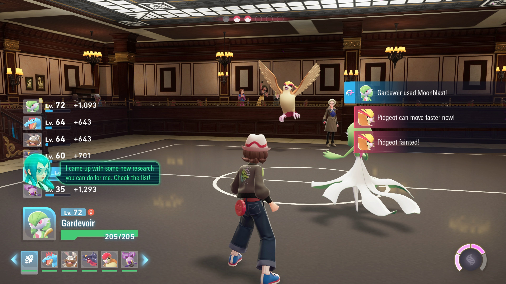

# Restaurant Farmer

## Program Description

Repeatedly battle the restaurants to farm experimence, items, and money.

There are currently 4 restaurants suitable for this:

- Restaurant Le Nah (1)
- Restaurant Le Yeah (2)
- Restaurant Le Wow (3)
- Sushi High Roller (3)

### Instructions

1. Make sure you have all 3 Gold Canari Plushies. Otherwise you will lose money over time!
2. Stand facing the restaurant receptionest.
3. Start the program in the game.

The program will spam 3 moves in the following priority:

- Top
- Left
- Bottom

It will never use the Right move slot as that is the A button which interferes with parts of the program.

If your Pokémon faints, it will automatically timeout and switch to the next Pokémon in your party. Keep that in mind if you expect your lead to faint. The move priority is the same for all members of your party.

The program currently is not programmed to handle a loss. So make sure your party is sufficiently strong to guarantee a win.

## Credits

- **Author:** Kuroneko/Mysticial

**Discord Server:** 

