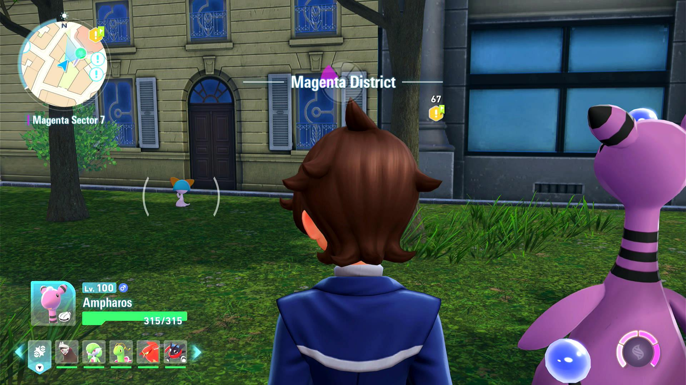

# Shiny Hunt - Overworld Reset

## Program Description

Automate this shiny hunting method: [https://x.com/astephen68/status/1981218146041438527](https://x.com/astephen68/status/1981218146041438527)

The core mechanic of this method is that after a Pokémon is despawned (defeated/caught), it will respawn in its original location after about 5 minutes. If you save just before it respawns, it will respawn immediately after resetting the game.

Therefore, this program is an efficent soft-reset based method to shiny hunt almost every Pokémon in the game - including those that are far away from benches or fly spots.

The important aspect of this method is that you must be close enough to the spawn for the shiny sound to play. So you should save either next to it, or (for skittish Pokémon) as close as possible without immediately scaring it away when it respawns.

(image credit: Scotteh)

### Instructions

1. Save near a Pokémon that is about to respawn.
2. Start the program in the game.
3. Make sure your "Reset Delay" option is long enough that the Pokémon is able to respawn with enough time to play the shiny sound with a few seconds to spare.

## Options

### Shiny Sound Detected Action

When a shiny sound is heard, perform one of the following actions:

- Stop program and go Home. Send notification. (default)
- Keep running. Notify on first shiny sound only.
- Keep running. Notify on all shiny sounds.

The only option you should use is "Stop program and go Home." The other options are incompatible with soft-resets and exists only because this entire option block is shared with the other shiny hunting programs.

### Take a Video

Record a video of the encounter.

### Screenshot Delay

When a shiny is detected, wait this long before you take a screenshot and record a video. This will allow the screen to completely load before taking the screenshot.

## Credits

- **Author:** Kuroneko/Mysticial

**Discord Server:** 

